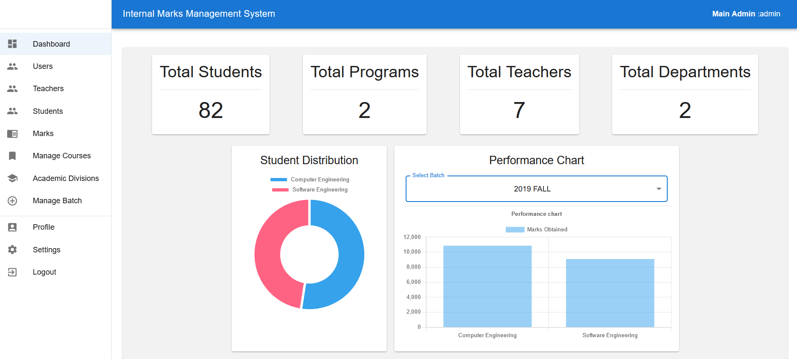
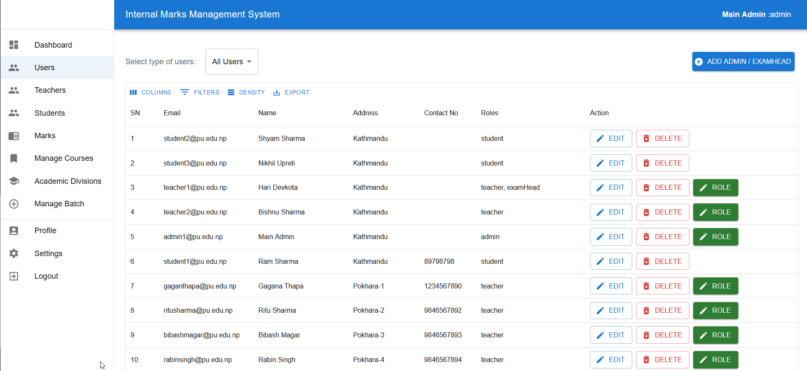
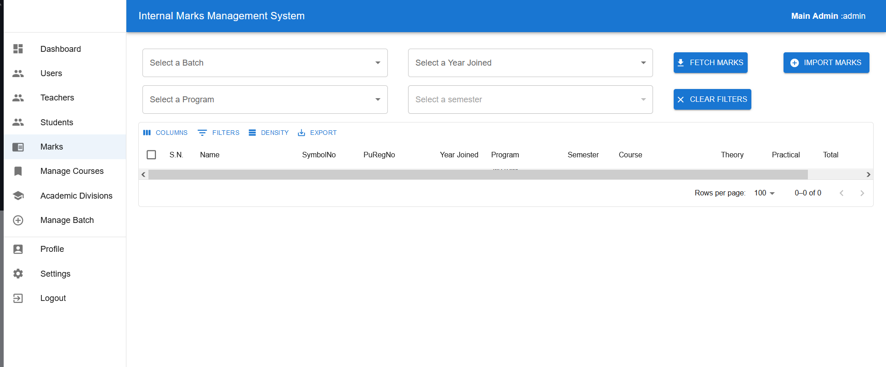
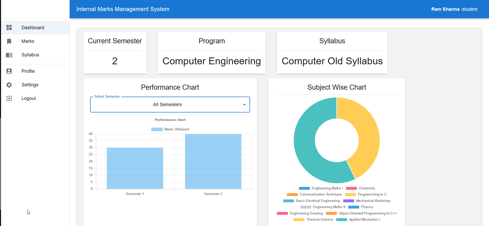
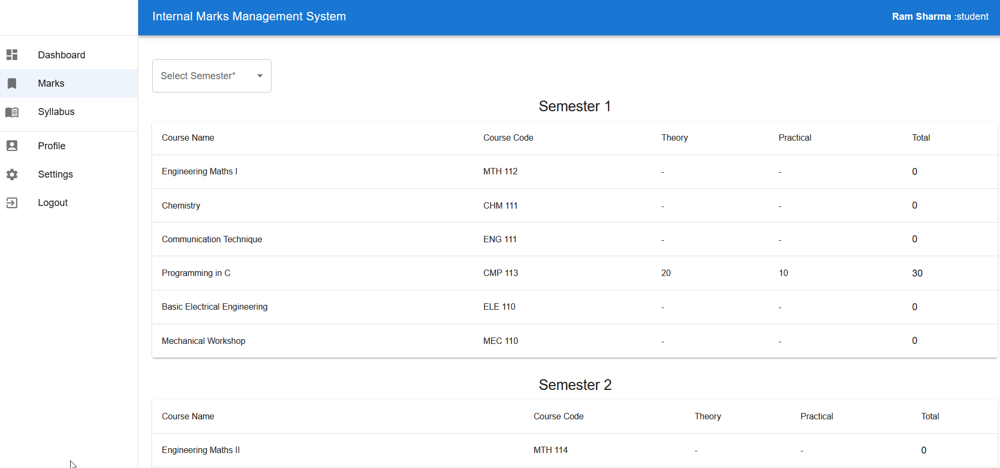
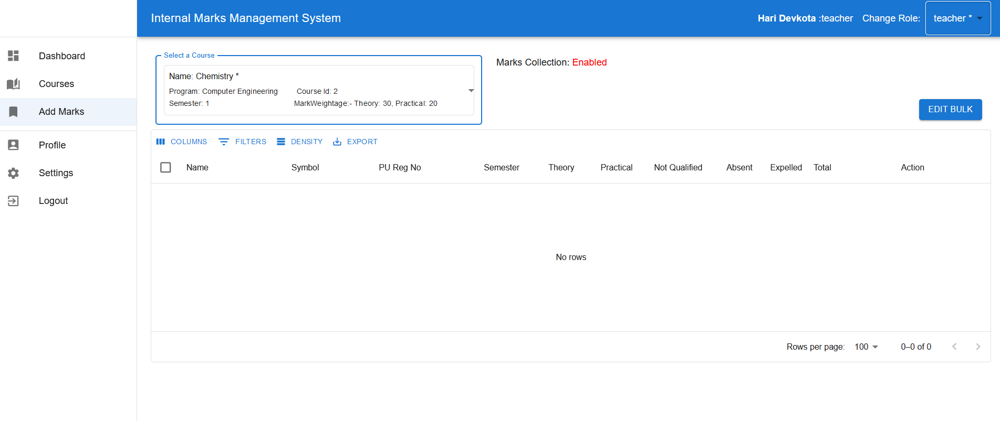

A marks management system is an integral part of an educational institute. It allows for easy access and management of student marks across the semesters and years.

This system was developed as a final year project for my undergraduate degree in Computer Engineering. It is aimed for higher educational instuties such as universities. It is a feature packed and secure management system.

> [Contact me](/contact) if you need a similar system.

### Features

1. Supports Multiple User Type (Admin, Teacher, Student, ExamHead)
2. Supports Bulk Data Import (csv)
3. Student can view their marks, syllabus and other details.
4. Teacher can add, view marks for their courses
5. Admin can overview overall processes of the system.
6. Supports multiple academic divisions: faculties, departments, programs and syllabus
7. Supports more: Semester upgrade, marks mgmt and export, role mgmt, course mgmt,....

### Stack Details

- Backend: Node (Express) + Prisma + Postgres
- Frontend: React + MUI + Reactjs-char
- JWT for security

### Details

To view the details about running the project.

_Please visit [Frontend-Repo](https://github.com/roshanlc/marks-mgmt-frontend) and [Backend-Repo](https://github.com/roshanlc/marks-mgmt-backend)_

### Screenshots

